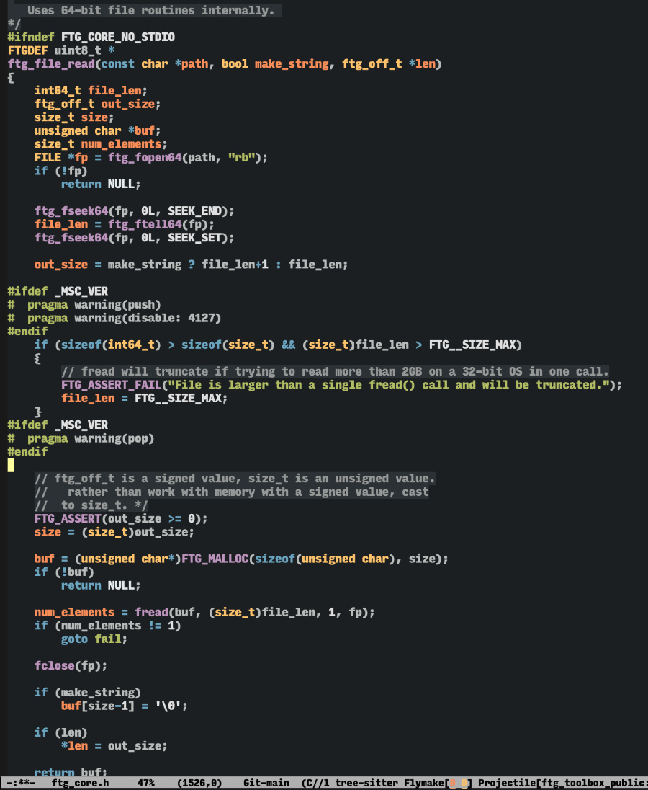

# copper-theme #

A theme that invokes the colours of copper interacting with sunlight.

Original; not a copy of a theme from another editor.  No light mode
alternative.

Designed for programming in an Emacs 29+ environment that could have
tree-sitter enabled.  Attention has been paid to details for typed
languages like c, where type, variable and keyword differentiation
are necessary for fast scanning.

Comments have background highlighting in order to produce block
shapes to allow for segregation of functionality in long functions.

## Screenshot ##

## Theme Status ##

Theme is mature and has been in use for years, but has just been released.  No distribution on Melpa, yet.

